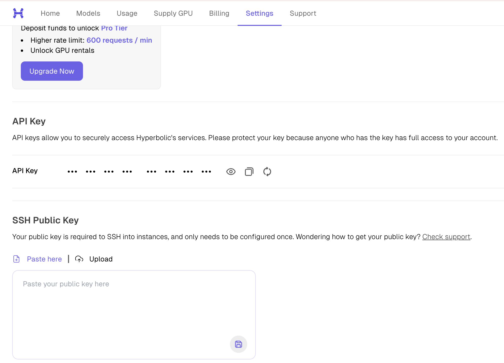
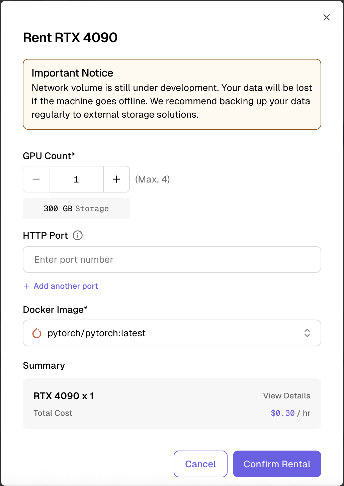
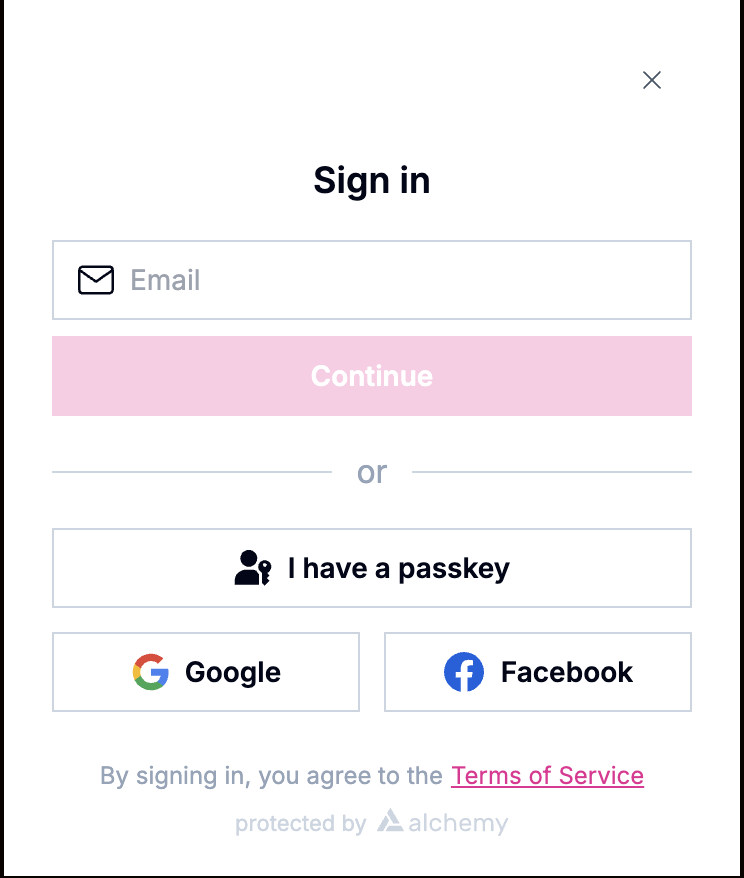
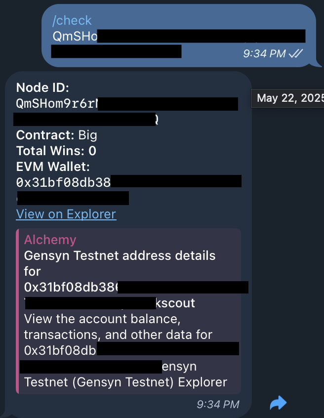
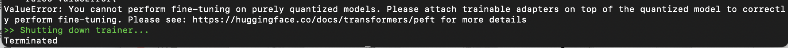

# Hyperbolic GPU 대여 & Gensyn 노드 구동 가이드

여러 가이드를 참조해 작성되었으며 MAC OS 환경에서 직접 실행하며 발생한 몇몇 에러케이스를 정리했습니다.

참조한 가이드 문서: [링크1](https://github.com/0xmoei/gensyn-ai) / [링크2](https://x.com/usmkols/status/1915695079425032491)<br>
공식 Gensyn 노드 레포지토리: [링크](https://github.com/gensyn-ai/rl-swarm)

## Hyperbolic 가입 및 세팅
[하이퍼볼릭 홈페이지](https://app.hyperbolic.xyz/invite/mayGxYBLt)에서 회원가입.

hyperbolic 인스턴스 접속을 위한 로컬 ssh 키 생성
```bash
ssh-keygen 
```
아래 명령어를 통해 나온 public 키 복사 후, 
```bash
cat ~/.ssh/id_rsa.pub
# 또는
cat ~/.ssh/id_ed25519.pub
```
Hyperbolic → Settings에 복사한 public key를 붙여넣고 저장



## GPU 대여 & 인스턴스 접속

크레딧 충전 (5$) 후 Rental GPU 리스트에서 가격이 낮은 GPU 선택(RTX 4090 또는 H100 권장)<br>
`GPU count: 1` / `Docker image: pytorch/pytorch:latest`로 설정



GPU가 준비 완료되면, 인스턴스에 접속할 수 있는 ssh 명령어를 복사(아래는 예시)
```bash
ssh ubuntu@subdued-koala-pig.1.cricket.hyperbolic.xyz -p 31423
```
로컬 터미널에서, 위의 명령어 뒤에 `-L 3000:localhost:3000`를 붙여서 인스턴스 접속
```bash
ssh ubuntu@subdued-koala-pig.1.cricket.hyperbolic.xyz -p 31423 -L 3000:localhost:3000
```
→ Gensyn userData 생성 시 웹 대시보드 접속을 위한 포트포워딩


## 의존성 패키지 설치
**1. Update System Packages**
```bash
sudo apt-get update && sudo apt-get upgrade -y
```
**2. Install General Utilities and Tools**
```bash
sudo apt install screen curl iptables build-essential git wget lz4 jq make gcc nano automake autoconf tmux htop nvme-cli libgbm1 pkg-config libssl-dev libleveldb-dev tar clang bsdmainutils ncdu unzip libleveldb-dev  -y
```

**3. Install Python**
```bash
sudo apt-get install python3 python3-pip python3-venv python3-dev -y
```

**4. Install Node**
```
sudo apt-get update
curl -fsSL https://deb.nodesource.com/setup_22.x | sudo -E bash -
sudo apt-get install -y nodejs
node -v
sudo npm install -g yarn
yarn -v
```

**5. Install Yarn**
```bash
curl -o- -L https://yarnpkg.com/install.sh | bash
```
```bash
export PATH="$HOME/.yarn/bin:$HOME/.config/yarn/global/node_modules/.bin:$PATH"
```
```bash
source ~/.bashrc
```

---

## 노드 레포지토리 클론
```bash
git clone https://github.com/gensyn-ai/rl-swarm/
```

---

## 노드 구동
백그라운드 실행을 위해
```bash
screen -S swarm
```
`rl-swarm` 디렉토리 진입
```
cd rl-swarm
```
실행
```bash
python3 -m venv .venv
source .venv/bin/activate
./run_rl_swarm.sh
```

터미널에 
`Waiting for userData.json to be created...` 메시지가 나타나면,
로컬 브라우저에서 `http://localhost:3000/` 접속 후 Gensyn 이메일 로그인



A100 or H100 의 경우 Math hard (B) 선택 후 → 파라미터 선택 (7B, 32B or 72B), 
기타 RTX 3090 or 4090의 경우 Math (A) 선택 후 → 파라미터 선택 (0.5B or 1.5B)

중간에 huggingface에 공유할거냐 묻는데, 선택사항이라 N 입력

실행 중 에러 발생시 아래 에러케이스 참조

## 노드 정보 확인 & 백업
Node ID와 Node Name은 노드 실행 중간중간에 나타나며,
Node ID는 Qm으로 시작, Node Name은 동물 이름 세가지로 구성<br>
필요 시 터미널에서 스크롤백 모드 진입 후 스크롤해서 찾기
```bash
Ctrl-A + [ #스크롤백 모드 진입
Q # 스크롤백 모드 나가기
```

https://t.me/gensyntrackbot(텔레그램 봇)에서 `/check node-id` 실행, node-id는 앞에서 찾은 Node ID로 대체



만약 0x00000000 이런식으로 EVM 주소가 제대로 연결되지 않았다면, 전체 프로세스를 새로운 이메일로 다시 시작해야합니다. <br>만약 정상적으로 일반적인 EVM 주소가 보인다면, `swarm.pem` 백업 진행<br>
`swarm.pem`은 생성된 Gensyn EVM address의 private key를 담고 있기 때문에, **유출에 주의**

백그라운드에서 실행을 유지한 채로 screen으로부터 detach<br>
`Ctrl + A, D`

`swarm.pem`을 hyperbolic 인스턴스의 root 경로로 복사 후 로컬로 복사
```bash
cp ./swarm.pem ~/swarm.pem
scp -P 31423 ubuntu@subdued-koala-pig.1.cricket.hyperbolic.xyz:~/swarm.pem ~/Downloads/
```
`31423`와 `ubuntu@subdued-koala~` 부분은 앞서서 hyperbolic 인스턴스에 접속했을 때 사용했던 명령어의 포트번호와 호스트네임으로 교체해서 사용하면되며, `~/Downloads` 대신 원하는 로컬 경로로 복사해도 됩니다. 

일정 시간 학습 후, 아래의 홈페이지에서 자신의 Node ID / Name 검색을 통해 기여도를 확인할 수 있습니다.<br>
https://dashboard-math-hard.gensyn.ai/ (math hard)<br>
https://dashboard-math.gensyn.ai/ (math)


## 에러케이스
여기에 존재하지 않는 에러케이스는 [공식 깃허브 이슈](https://github.com/gensyn-ai/rl-swarm/issues) 혹은 [공식 디스코드](https://discord.gg/gensyn)를 참조하세요. 버전 업데이트마다 수많은 에러케이스가 발생하는 것으로 보입니다..ㅜㅜ


### `http://localhost:3000/` 실행 시 “Loading…” 에서 넘어가지 않는 경우


프로세스 종료
```bash
Ctrl + C
```
파일 수정
```bash
nano modal-login/app/page.tsx
```
내용 전부 삭제(`Ctrl+K`) 후, 아래 코드 붙여넣기
```bash
"use client";
import {
  useAuthModal,
  useLogout,
  useSigner,
  useSignerStatus,
  useUser,
} from "@account-kit/react";
import { useEffect, useState } from "react";

export default function Home() {
  const user = useUser();
  const { openAuthModal } = useAuthModal();
  const signerStatus = useSignerStatus();
  const { logout } = useLogout();
  const signer = useSigner();

  const [createdApiKey, setCreatedApiKey] = useState(false);

  useEffect(() => {
    if (!user && createdApiKey) setCreatedApiKey(false);
    if (!user || !signer || !signerStatus.isConnected || createdApiKey) return;

    const submitStamp = async () => {
      const whoamiStamp = await signer.inner.stampWhoami();
      const resp = await fetch("/api/get-api-key", {
        method: "POST",
        body: JSON.stringify({ whoamiStamp }),
      });
      return (await resp.json()) as { publicKey: string };
    };

    const createApiKey = async (publicKey: string) => {
      await signer.inner.experimental_createApiKey({
        name: `server-signer-${Date.now()}`,
        publicKey,
        expirationSec: 60 * 60 * 24 * 62,
      });
    };

    const handleAll = async () => {
      try {
        const { publicKey } = await submitStamp();
        await createApiKey(publicKey);
        await fetch("/api/set-api-key-activated", {
          method: "POST",
          body: JSON.stringify({ orgId: user.orgId, apiKey: publicKey }),
        });
        setCreatedApiKey(true);
      } catch (err) {
        console.error(err);
        alert("Something went wrong. Please check the console.");
      }
    };

    handleAll();
  }, [createdApiKey, signer, signerStatus.isConnected, user]);

  useEffect(() => {
    if (typeof window === "undefined") return;
    try {
      if (typeof window.crypto.subtle !== "object")
        throw new Error("Crypto API not available");
    } catch {
      alert("Please use HTTPS or localhost.");
    }
  }, []);

  useEffect(() => {
    if (!user && !signerStatus.isInitializing) openAuthModal();
  }, [user, signerStatus.isInitializing]);

  return (
    <main className="flex min-h-screen flex-col items-center gap-4 justify-center text-center">
      {signerStatus.isInitializing || (user && !createdApiKey) ? (
        <>Loading...</>
      ) : user ? (
        <div className="card">
          <div className="flex flex-col gap-2 p-2">
            <p className="text-xl font-bold">
              YOU ARE SUCCESSFULLY LOGGED IN TO THE GENSYN TESTNET
            </p>
            <button className="btn btn-primary mt-6" onClick={logout}>
              Log out
            </button>
          </div>
        </div>
      ) : (
        <div className="card">
          <p className="text-xl font-bold">LOGIN TO THE GENSYN TESTNET</p>
          <div className="flex flex-col gap-2 p-2">
            <button className="btn btn-primary mt-6" onClick={openAuthModal}>
              Login
            </button>
          </div>
        </div>
      )}
    </main>
);
```
저장 & 종료
```bash
Ctrl+O → Enter → Ctrl+X
```
노드 재실행
```bash
python3 -m venv .venv && \
source .venv/bin/activate && \
./run_rl_swarm.sh
```

### transformers 패키지 관련 에러



`transformers` 패키지 다운그레이드 후 노드 재실행
```bash
pip install transformers==4.48.2
./run_rl_swarm.sh
```